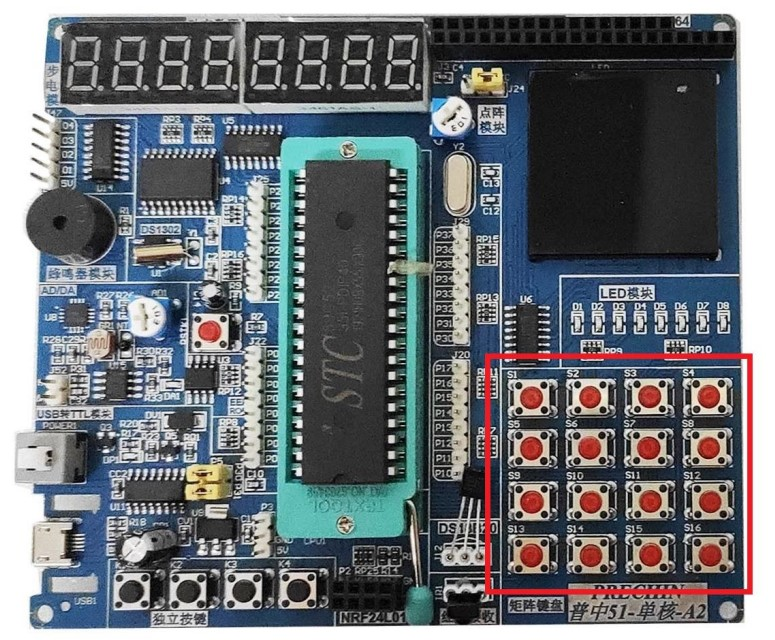

## Task 19: 4x4 Keypad Interfacing with STC89C52 Microcontroller

### Objective:
This task involves interfacing a 4x4 keypad with the STC89C52 microcontroller and running three different applications (calculator, real-time clock, and temperature monitor) in a non-blocking manner using a state machine. The applications will switch using the keypad's "ON/C" button.

### Task Breakdown:

1. **Keypad Interfacing:**
   - Interface the 4x4 keypad with the STC89C52 microcontroller.
   - Use a non-blocking approach to ensure that holding down a key does not block code execution.
   - Implement non-blocking debouncing for reliable key presses.
   - Label the keypad as follows (use a piece of paper to mark the symbols):  
     `1 2 3 A`  
     `4 5 6 B`  
     `7 8 9 C`  
     `* 0 # D`
   
2. **Displaying Key Presses:**
   - Display the pressed key on both the LCD and seven-segment display.

3. **Basic Calculator:**
   - Implement a basic calculator that supports addition, subtraction, multiplication, and division.
   - Use the keypad for input and display the result on the LCD/seven-segment display.

4. **State Machine for Multiple Applications:**
   - Create a state machine to run three different applications in one program. The applications are:
     1. **Calculator**
     2. **Real-time Clock (RTC)**
     3. **Temperature Monitor**
   - Pressing the "ON/C" button on the keypad will cycle through the applications in the following order:
     1. Calculator → Real-time Clock → Temperature Monitor → (Repeat)
   - Initially, the calculator app will be active. Pressing "ON/C" will switch to the Real-time Clock, pressing it again will switch to the Temperature Monitor, and so on.
   
5. **Real-time Clock (RTC):**
   - Display the time and date from the RTC module when the real-time clock application is active.

6. **Temperature Monitor with Threshold Input:**
   - Modify the temperature monitor application to allow the user to set a temperature threshold using the keypad.
   - Display the current temperature on the LCD/seven-segment display.

7. **State Machine Diagram:**
   - Refer to the state machine diagram in the videos below to understand the concept:
     - [State Machines Video 1](https://www.youtube.com/watch?v=TzTl4pdEYWE&ab_channel=5MinutesEngineering)
     - [State Machines Video 2](https://www.youtube.com/watch?v=TM4xTNRH1bw&ab_channel=5MinutesEngineering)
   - Use a switch-case structure in the code to manage the different states (applications) of the program. The state changes when the "ON/C" button is pressed.

8. **Code Structure:**
   - Organize your code into separate files to make it easier to manage:
     - `calculator.c`, `calculator.h`
     - `RTC.c`, `RTC.h`
     - `temp_monitor.c`, `temp_monitor.h`

---

### Features:
- **Non-blocking Keypad Interfacing:** Ensures that the system does not halt if a button is held down.
- **State Machine for Application Switching:** Allows seamless switching between Calculator, RTC, and Temperature Monitor apps using a single button.
- **Temperature Threshold Setting:** Users can set a custom temperature threshold via the keypad in the temperature monitor application.

---
